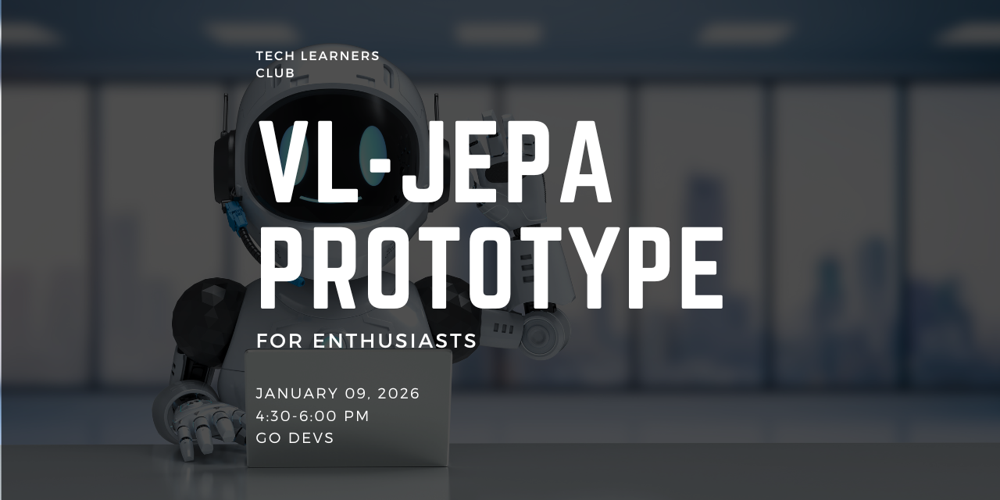
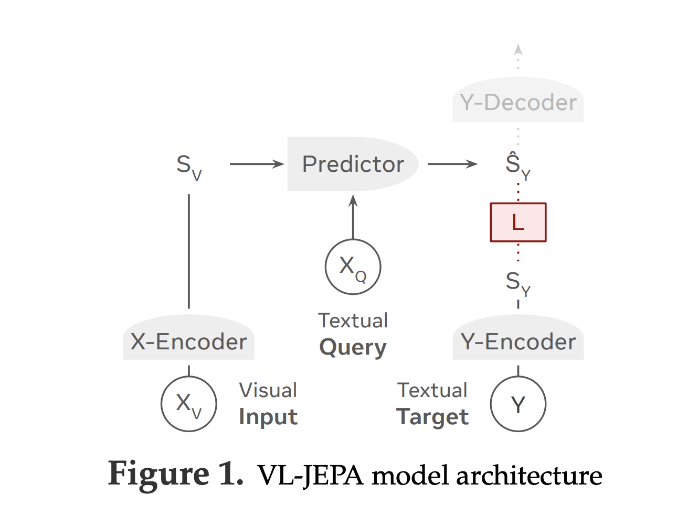

  

# VL-JEPA – Non-Generative Visual Understanding (Prototype)
VL-JEPA (Vision-Language Joint Embedding Predictive Architecture) is a new research direction that moves away from traditional generative AI models. Instead of generating text token by token to “figure out” meaning, VL-JEPA learns meaning directly in an embedding space. The model understands what is happening in a scene internally and only produces language when explicitly asked. In short: it knows first, then speaks if needed.

This approach is powerful for real-time perception because it avoids unnecessary generation, reduces latency, and focuses on semantic understanding rather than storytelling. It is especially relevant for applications like live video analysis, robotics, AR/VR, agents, and world models—where understanding matters more than talking.

----

# Index
| Module | Topic | Description | Folder |
|--------|-------|-------------|--------|
| 01 | Real Time Trainig | sample architecture and Implementation for realtime training model | [Real Time Trainig Architecture](RTT.md) |
<!-- | 02 | PostgreSQL | Relational database concepts, schema design, ingestion & querying | 02-postgres/ |
| 03 | Terraform | Infrastructure as Code, AWS basics, and building a data lake | 04-Terraform/ | -->

----

# Our Implementation (What we built)
In this project, we implemented a VL-JEPA–inspired real-time perception system that works with both live webcam streams and prerecorded videos. We use a frozen vision encoder to extract visual embeddings, a lightweight predictor network to model semantic meaning, and a text embedding space to interpret what the scene represents. Instead of generating text every frame, the system monitors semantic change in embedding space and responds only when something meaningful changes.

### Our system:
- Processes live or recorded video streams
- Generates human-readable scene descriptions only when the scene changes
- Displays results as a clear, centered overlay on the video
- Remains quiet and stable when nothing important changes

This project is intentionally non-generative at its core—language is treated as a readout, not the reasoning mechanism—staying true to the VL-JEPA philosophy.

## Key Features
- Real-time webcam & video file inference
- Non-generative, embedding-based understanding
- Semantic change detection
- Scene-level narration (not frame-by-frame noise)
- Clean, readable video overlays
- macOS (MPS), CPU, and CUDA compatible

## Why this matter
This prototype demonstrates how non-generative AI systems can be more efficient, interpretable, and better suited for real-world perception tasks. It’s a small but practical step toward AI systems that understand first and speak only when necessary. (The Future Updates will include more practical and production grad Implementations)

# Technical Architecture & Implementation

This project follows the core VL-JEPA principle: predict meaning in embedding space, not tokens. The system is composed of modular components that separate perception, semantic reasoning, and language readout, allowing efficient real-time inference.

  

1. Vision Encoding (Frozen Perception Backbone)

Each video frame (from webcam or prerecorded video) is processed by a frozen vision encoder. This encoder converts raw pixels into a dense visual embedding that represents the semantic content of the scene. The vision encoder is not trained during this project—keeping perception stable and efficient.

2. Joint Embedding Prediction (Core VL-JEPA Idea)

A lightweight predictor network takes:
- the visual embedding from the vision encoder, and
- a prompt embedding (e.g., “What objects are visible?”),

and maps them into a shared semantic embedding space.
This embedding represents what the model understands about the current scene—without generating any text.

The predictor is trained using embedding alignment (cosine similarity) against text embeddings, not token-level supervision. This keeps the system non-generative by design.

3. Text Embedding Space (Semantic Targets)

Object names or concepts (e.g., person, cup, laptop) are embedded using a text encoder into the same semantic space. During inference, the predicted scene embedding is compared against these text embeddings to determine what the scene most closely represents.

4. Semantic Change Detection (Streaming Intelligence)

Instead of reacting to every frame, the system maintains a short temporal buffer of embeddings and computes semantic similarity across time. A scene is considered “changed” only if the embedding difference crosses a defined threshold. This avoids flicker, frame noise, and redundant outputs.

5. Language as a Readout (Not Reasoning)

Natural language descriptions are generated using deterministic sentence templates, triggered only when a semantic change occurs. Language is treated purely as a presentation layer, not a reasoning mechanism—staying aligned with the VL-JEPA philosophy.

6. Unified Inference Pipeline

A single inference pipeline supports:
- live webcam streams, and
- prerecorded video files

with the same logic and behavior. Results are rendered as high-visibility, centered overlays on the video feed for clear real-time feedback.